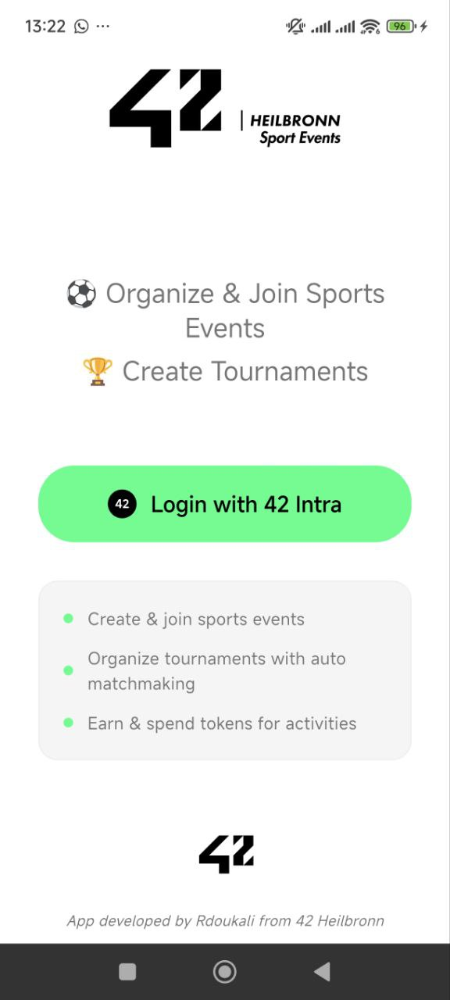
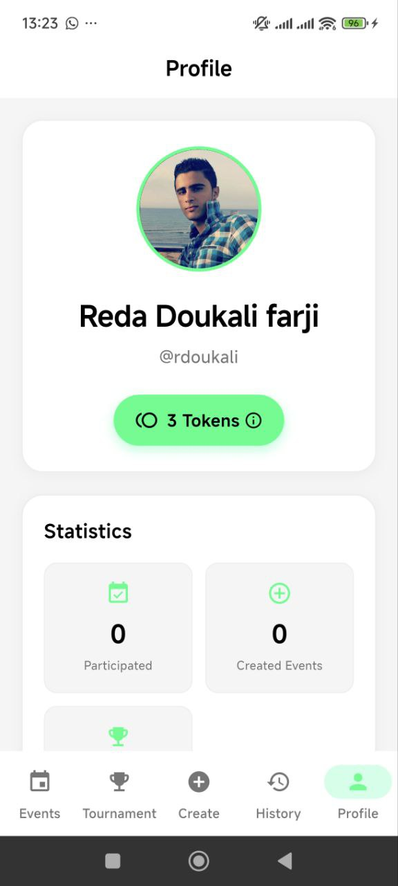
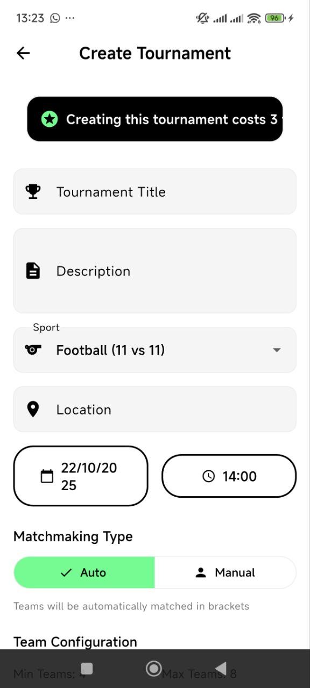

# 42Sports - Sports Event Management Platform

A Flutter-based mobile app for organizing sports events at 42 campuses with a token-based economy system.

---

## 🚀 Quick Start (Easiest Way)

### 1. Download APK
**[Download 42Sports APK](https://drive.google.com/file/d/1V3rkLjOLQpaq29DbHyzkDOxL1_HF6YKT/view?usp=sharing)** (Shuted down for safety reasons - BUILD YOUR APP)

### 2. Install on Android Device
1. Transfer APK to your Android device
2. Enable "Install from Unknown Sources"
3. Install and open 42Sports

### 3. Start Backend Server
```bash
cd backend
npm install
node server.js
```

### 4. Configure API Keys
Edit `42Sports/lib/utils/constants.dart`:
```dart
static const String clientId = 'your_42_client_id';
static const String clientSecret = 'your_42_client_secret';
```

### 5. Use the App
- Sign in with your 42 account
- Take the Welcome Quiz (earn 3 tokens)
- Create events or join existing ones!

---

## 🛠️ Development Setup

### Prerequisites
- Flutter SDK
- Android Studio / Xcode
- Node.js

### Backend Setup
```bash
cd backend
npm install
node server.js
```

### App Setup
```bash
cd 42Sports
flutter pub get

# Add your 42 API credentials to lib/utils/constants.dart
flutter run  # For development
flutter build apk --release  # For production APK
```

---

## 📸 Screenshots

### Welcome & Authentication
<p align="center">
  
  <br>
  <em>42 OAuth Authentication</em>
</p>

### Token System & Profile
<p align="center">
  
  <br>
  <em>Profile Dashboard - Track tokens and history</em>
</p>

### Welcome Quiz
<p align="center">
  
  <br>
  <em>Welcome Quiz - Earn your first 3 tokens</em>
</p>

### Event Discovery
<p align="center">
  
  <br>
  <em>Events Feed - Browse and join sports events</em>
</p>

### Tournament Management
<p align="center">
  
  <br>
  <em>Tournament Hub - View active tournaments</em>
</p>

### Event Creation
<p align="center">
  
  <br>
  <em>Create Tournament - Advanced tournament setup</em>
</p>

---

## 🎯 Token Economy

- **Start**: 0 tokens → Take quiz → 3 tokens
- **Create Event**: 1 token
- **Create Tournament**: 3 tokens
- **Complete Event**: +1 token reward
- **Cancel Event**: Full refund (before start)
- **Maximum**: 5 tokens

---

## ✨ Features

- 🔐 42 OAuth authentication
- 🎫 Token-based event creation
- 🏆 Tournament bracket system
- 👥 Event management & participation
- 📱 Clean, modern UI
- 🔄 Real-time updates

---

## 🤝 Contributing

Want to contribute? Feel free to:
- Fork the project
- Create a pull request
- Or DM me on 42 Intra

Built for the 42 community! 🏆
